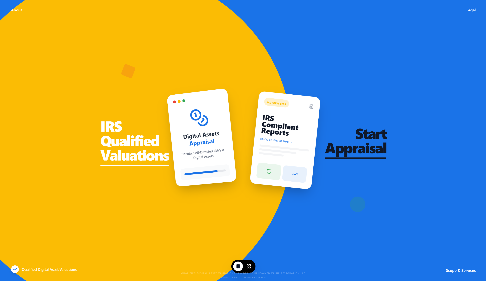

# QDAV - Qualified Digital Asset Valuations

  

> **Note on Image:** The banner image above references a `banner.png` file in the root of the repository. Before publishing, please save your attached image as `banner.png` to the root folder, or drag-and-drop the image into GitHub's web editor to replace this placeholder.

## Specialized Valuation Expertise 📈

Qualified Digital Asset Valuations (QDAV), a DBA of Renowned Value Restoration LLC, provides IRS-compliant, institutional-grade valuation services for complex digital assets including cryptocurrencies, DeFi positions, and NFTs.

Our services bridge the gap between traditional finance requirements and web3 complexities, delivering:
- **Digital Asset Appraisals** for Bitcoin, SDIRA, and unique assets.
- **Estate & Date-of-Death Valuations** providing historical pricing.
- **Charitable Donations compliance** under IRS Section 170.
- **Divorce & Litigation Support** with forensic-level accuracy.

Visit us at **[qdav.mba](https://qdav.mba)**

## 🚀 Run and Deploy Locally

This project is built using modern tooling with Vite and React.

### Prerequisites
- Node.js (v18+ recommended)

### Quickstart

1. **Install dependencies:**
   \`\`\`bash
   npm install
   \`\`\`

2. **Run the development server:**
   \`\`\`bash
   npm run dev
   \`\`\`

3. **Deploy to GitHub Pages:**
   This project is configured to easily deploy to GitHub Pages. Run the following command. It will build your app and push it onto the `gh-pages` branch.
   \`\`\`bash
   npm run deploy
   \`\`\`
   *(Ensure your GitHub repository settings specify the `gh-pages` branch for hosting, and verify your custom domain in the Pages tab).*
